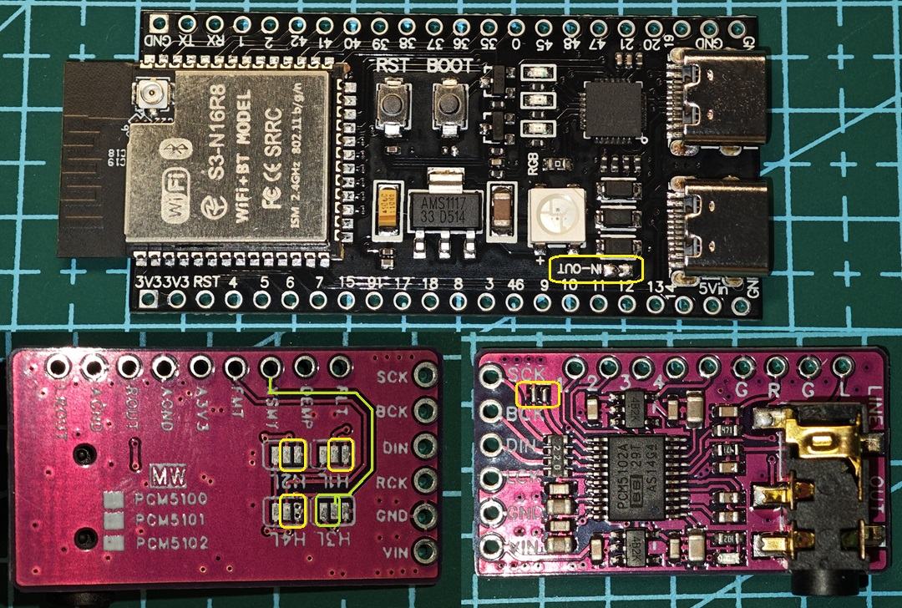
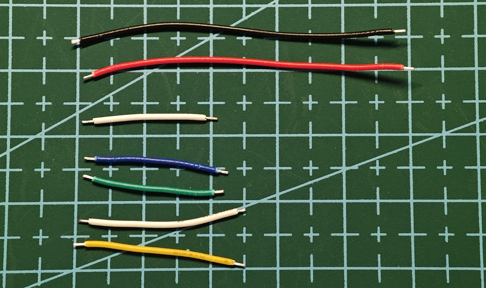
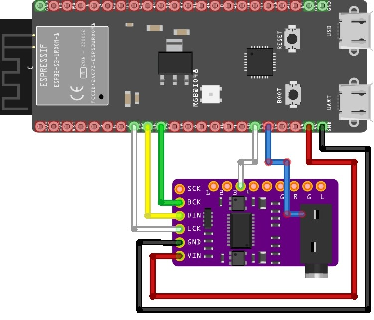
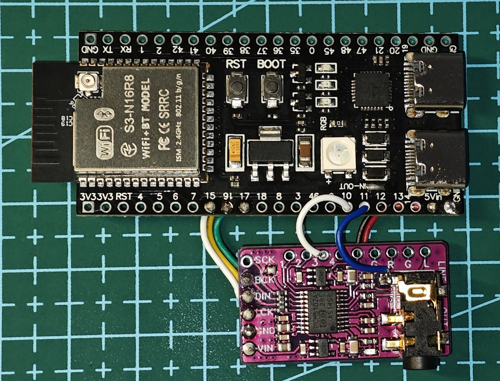
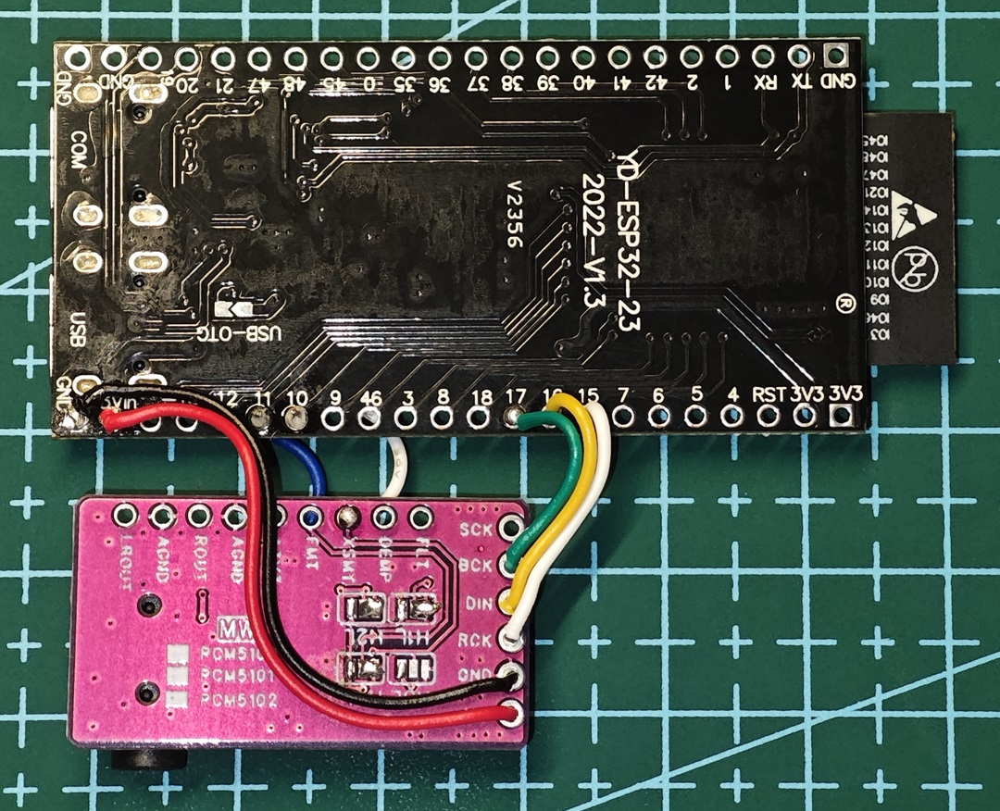
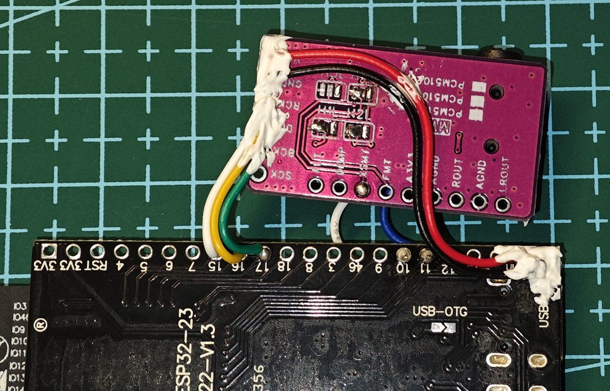
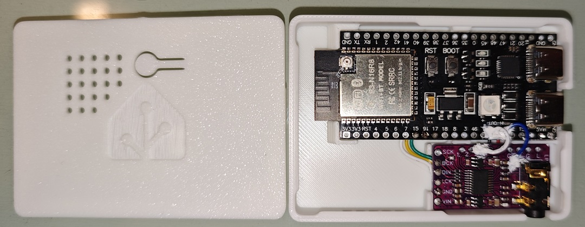

# Building & Soldering Guide

_This section covers the hardware preparation and soldering process for the ESP32-S3 Media Player._

---

## Step 1: PCB Preparation

Before wiring, prepare the two boards (ESP32-S3 and PCM5102A DAC) by configuring their solder bridges.

  

### ESP32-S3 Board
* Connect the **IN-OUT pads** using a solder bridge to enable 5V power output to external devices.
* **Note on Voltage:** Some online guides suggest using 3.3V to power the DAC. In my testing, there was no significant difference in audio quality. Using 5V results in a cleaner wire layout, which is what I chose for this build. You may decide based on your preference.

### PCM5102A DAC Board
* **Backside Jumper Settings:** Bridge the center pads of **1, 2, and 4** to **L (GND)**.
* **Mute Control (Jumper 3):** * If you don't need manual mute control: Bridge the center pad to **H**.
    * If you want software/manual control: Leave it open.
    * **⚠️ Important Tip (Silkscreen Error):** On my specific DAC board, the silkscreen was printed incorrectly. I initially bridged to "L," but a multimeter check revealed that the side labeled "H" was actually the true GND. **Always measure continuity with a multimeter or trace the PCB paths before soldering to confirm which side is GND.**
* **Frontside:** Connect the **SCK and GND** pads with a solder bridge.

## Step 2: Cable Preparation

I2S is a high-frequency signal; keeping wires short is critical for signal integrity.

  

* **I2S Signal Wires:** Suggested length 20mm ~ 30mm. I used one 20mm and two 25mm wires. This length is optimized for the custom enclosure.
* **Power & Ground:** Approximately 50mm (VCC wire can be shorter if using 3.3V).
* **Control Wires:** Two 20mm wires (one for the **XSMT** mute pin and one for **Jack Detection**).
* **Note:** Short wires lead to a cleaner build but require more precision during soldering. Longer wires are acceptable if you need more room to maneuver.

## Step 3: Soldering the Connections

Map and solder the wires according to the schematic.

  

* **I2S Pins:** While pins 4, 5, 6, 7, 15, 16, and 17 on the ESP32-S3 are all fine for use as I2S signal wires, I used **GPIO 15, 16, and 17** for the shortest physical path.
* **Control Pins:** GPIO **10** for XSMT (Mute) and GPIO **11** for Headphone Detection. (Optional)
* **Routing:** For a professional look inside the enclosure, I routed the I2S and power lines along the **back** of the board, while the mute and detection lines run across the **top**.
* **⚠️ Fitment Tip:** If you choose 3.3V power, use the **second 3.3V pin** on the ESP32 board. Using the first one will interfere with the enclosure's support brackets, preventing the board from seating correctly.

  

  

## Step 4: Final Assembly

1.  **Stress Relief:** Apply a small amount of glue (like 704 glue) at the base of the wires to provide strain relief.
2.  **Mounting:** Once the glue is dry, place the boards into the enclosure. Route the backside wires through the gaps between the support blocks.
3.  **Done!** Your hardware is now ready for the software.

  

  

---
**Next Step:** [Software Configuration & Debugging](./02.debugging.md)
